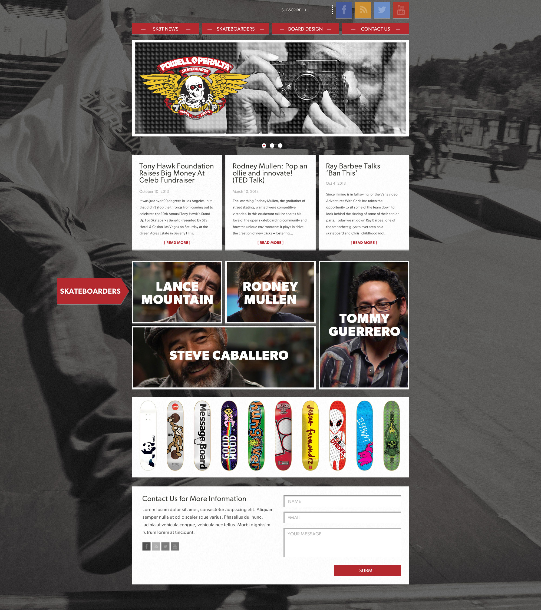

#2.2-Sass-RWD

This project was my first attempt at using a grid framework (Neat) in a sass tool set (Bourbon). This was also one of my first attempts at building a fully responsive web page. I used the following wireframe as a guide.

